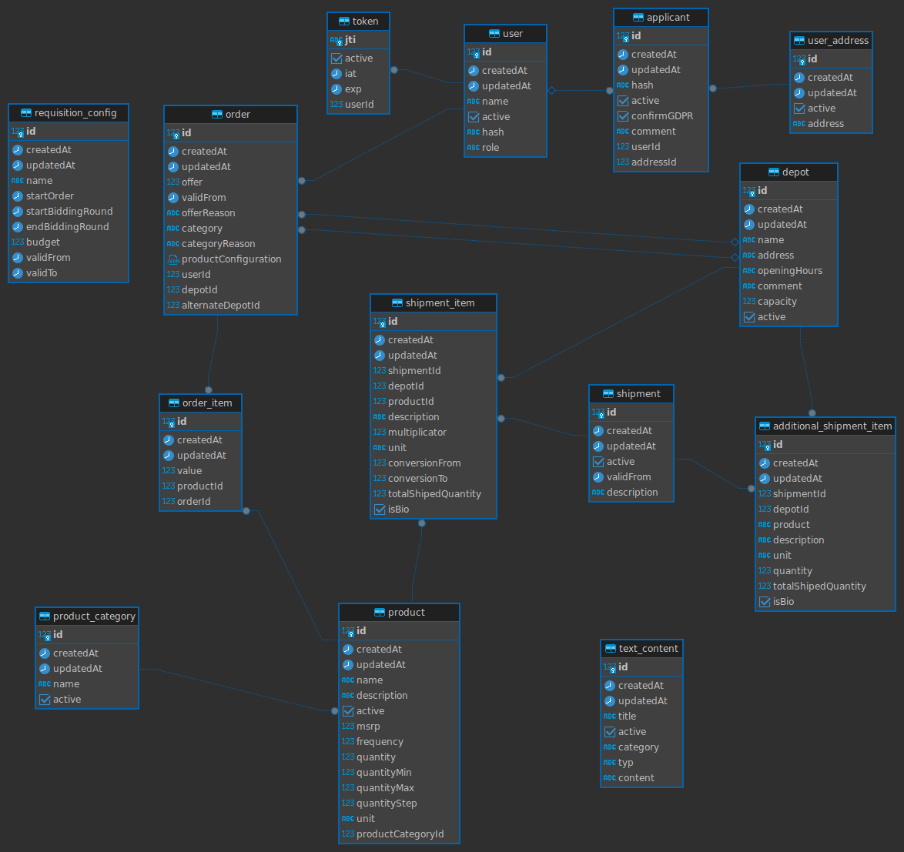

# Development

When adding new files, don't forget to add the AGPLv3 header to it. This can be done
by executing `./apply_license_headers.bash` in the project root (requires python3).

## Generate migrations

```
npm run typeorm -- migration:generate -d ./src/database/database.ts ./src/migrations/<migrationname>
```

## Pre commit hook

[pre-commit](https://pre-commit.com/) may be used to ensure code quality already when commiting. One-time setup:

```
pip3 install pre-commit
pre-commit install

# if not done already, make sure that npm dependencies are installed in /frontend and /backend
```

Hooks are defined in [pre-commit-config.yaml](./pre-commit-config.yaml).

## Testing

### CI

This project uses Github Actions for CI. To run all tests locally use https://github.com/nektos/act

When using [Github CLI](https://cli.github.com/) run

```
# installation
gh extension install https://github.com/nektos/gh-act

# running workflow scripts
gt act
```

### Backend tests

For local testing a Postgres container must be started (default port 5533):

```
docker compose -f compose-testing.yaml up
```

To start the live test server run

```
cd backend
npm run test
```

## Deployment

Run `./dev/build/build-and-deploy.bash` from the project root to built up-to-date containers locally.

Run `docker compose up -d` to start.

## Glossary

stock: g/ml/Stk

## Database Schemas

### After 'order-valid-from.ts' migration


